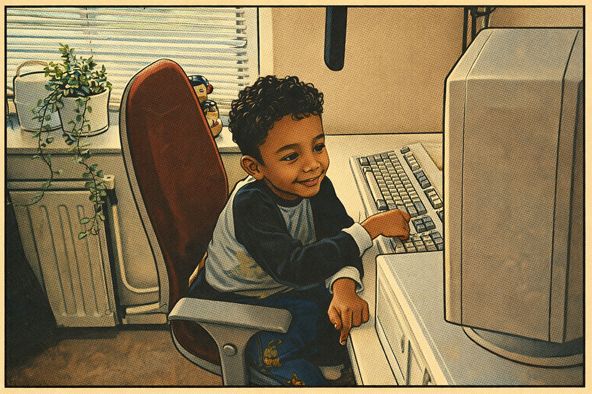
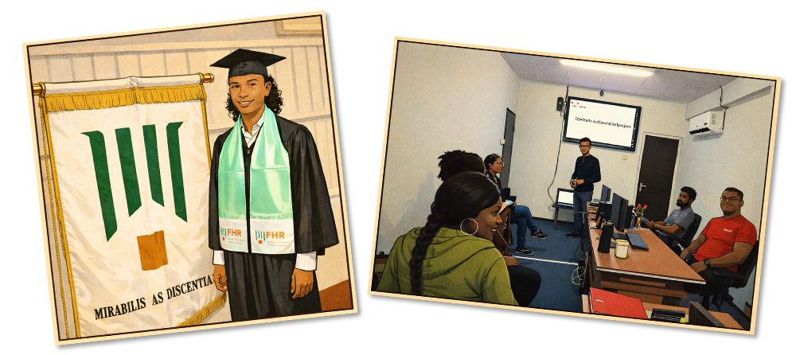
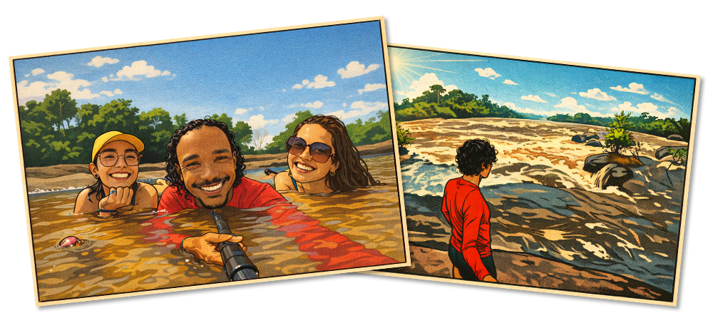
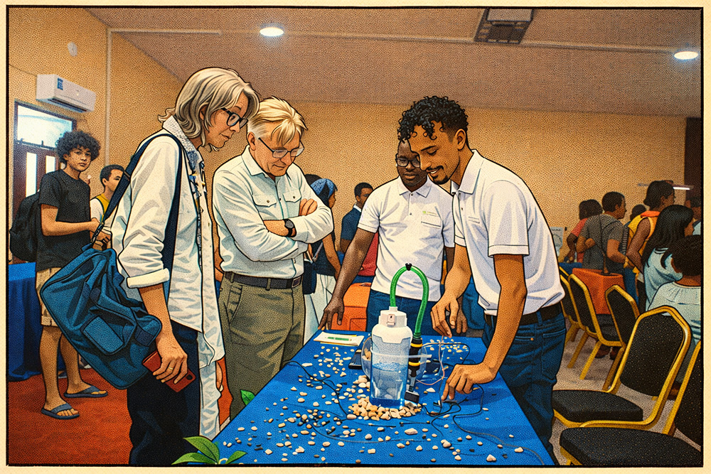

<strong>Software Engineer / Tech Enthusiast</strong>

A lifelong learner, passionate about creating connected web experiences

  
  

---

  <h3 align="center">Tech I work with</h3>

  
  
  
  
  
  
  
  
  
  
  
  

  My favorite IDE at the moment? <strong>Cursor!</strong> ❤️

---

...I've been messing with computers for as long as I can remember.

  <h3 align="center">It all started when I was 7...</h3>

  

I got my first taste of tech when my dad brought home a Windows 95 PC and let me mess around in Paint.

By age 10, I coded my first HTML website in Notepad (GeoCities era—pre-Google 😄).

Gaming pulled me deeper into coding, graphics and 3D modeling.

After graduating bachelor in business administration, a small trip turned into helping tourism businesses, then building software for more companies to automate processes and unexpectedly leading me to travel across my country and spend plenty of time in the rainforest.

<a href="https://www.youtube.com/@DustinDestinations" target="_blank">Watch my travel YouTube channel</a>

  

In 2023, after 9 years of travel, I decided to formalize my self-taught coding path with a Bachelor’s in ICT and in my first year, my team won first place at a prototyping fair with an IoT project.

  
    So that mix of <strong>passion for tech, curiosity and creativity</strong> never really left... 👀 and I don't think it ever will...
  

---

### 🧠 What I’m into now
As I'm on this new journey, I love building things where **software meets the real world**:

- 🌐 Creating software solutions (PHP, JavaScript, Python)
- 🧩 Learning more 3D game development using Three.js
- 🔌 IoT & hardware (Raspberry Pi, sensors, smart systems)
- ⚙️ Backend logic, APIs, dashboards

If it can be automated, optimized or connected, I’m interested!      
          
---
### ⚡ Fun fact
So, everything tech I do today AI, IoT, automation, software design traces back to:

Just a stay at home kid on Windows 95, wanting to learn to type fast,
learning HTML,
building a website
for a FPS clan 😄