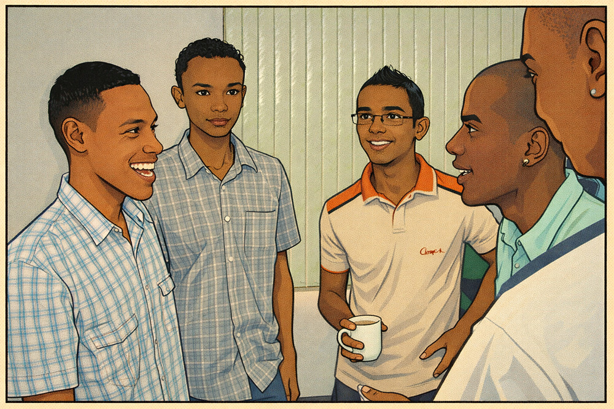
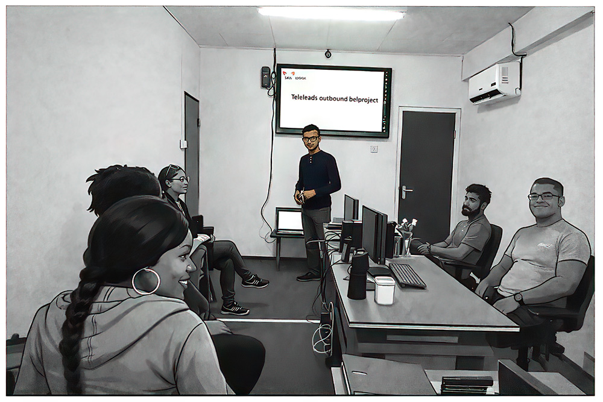

# 👋 Hi, I’m Dustin

I’m a **software engineer / builder / tech enthusiast** who’s been messing with computers for as long as I can remember.

### How it all started


- I started with tech at **age 7**, running **Windows 95**
- At **age 10**, I built my **first HTML webpage** (in Notepad!) while **GeoCities** was still a thing and Google didn't exist yet. Yes, the browsers we used were Internet Explorer and Netscape. Not sure if you heard about Netscape..
- Gaming pulled me deeper into development as I wanted my **own website** for my **online clan** and got some help from my first online friends at that time (when there was no Google, YouTube or ChatGPT!)
- My mom and uncle inspired me into me really wanting to be able to type fast at that time
- I was playing **Quake 2 online** as a kid and suddenly coding, graphics, 3D modelling and servers became just as exciting as fragging 😄

A bit later I found a virtual community called Cybertown where I helped building 3D assets and provide coding help. With these new skills I managed to find my first developer job at a local company called Alembo way back in 2004/2005 'ish




After about 4 years working there, making long hours, I decided to get a bachelor's degree in management and law, which I graduated in, as I found I lacked those skills at that time.



And more later, not long after that.. I helped businesses on a larger scale, developing software to automate important processes and help them get things done which eventually (and unexpectedly) caused me to travel a lot in my country and explore beautiful places


So that mix of **curiosity and creativity** never really left... 👀 I don't think it ever will...


So in 2023, after doing lots and lots of travel, I was thinking, I'm a self-taught developer, but what if I do another bachelor... in ICT? The more I was thinking about the idea, the more it inspired me to do it. So I decided to start this new journey and in the first year I won first place with my team at prototyping fair where we had to build something in terms of the Internet of Things.

---

### 🧠 What I’m into now
As I'm on this new journey, I love building things where **software meets the real world**:

- 🌐 Web development (PHP, JavaScript, modern stacks)
- 🔌 IoT & hardware (Raspberry Pi, sensors, smart systems)
- ⚙️ Backend logic, APIs, dashboards & tooling

If it can be automated, optimized or connected, I’m interested!

---

### 🛠️ Tech I work with
```txt
Languages:   Python, PHP, JavaScript, HTML, CSS, SQL
Hardware:    Raspberry Pi, Arduino, sensors
Servers:     Real-time systems, setting up Linux servers, API's 

My favorite IDE at the moment? Cursor! ❤️
```

---
### 💬 Ask me about

- Web development & backend logic
- Raspberry Pi & hardware integration
- AI basics, NLP & automation
- Turning ideas into working systems
- Or simply video, photography, 3D modelling
- and maybe Gaming?

---
### 📫 How to reach me

- GitHub: right here 👋
- LinkedIn
- Facebook
- Email

---
### ⚡ Fun fact
So, everything tech I do today AI, IoT, automation, software design traces back to:

Just a stay at home kid on Windows 95, wanting to learn to type fast,
learning HTML,
building a GeoCities page,
for a Quake 2 clan 😄